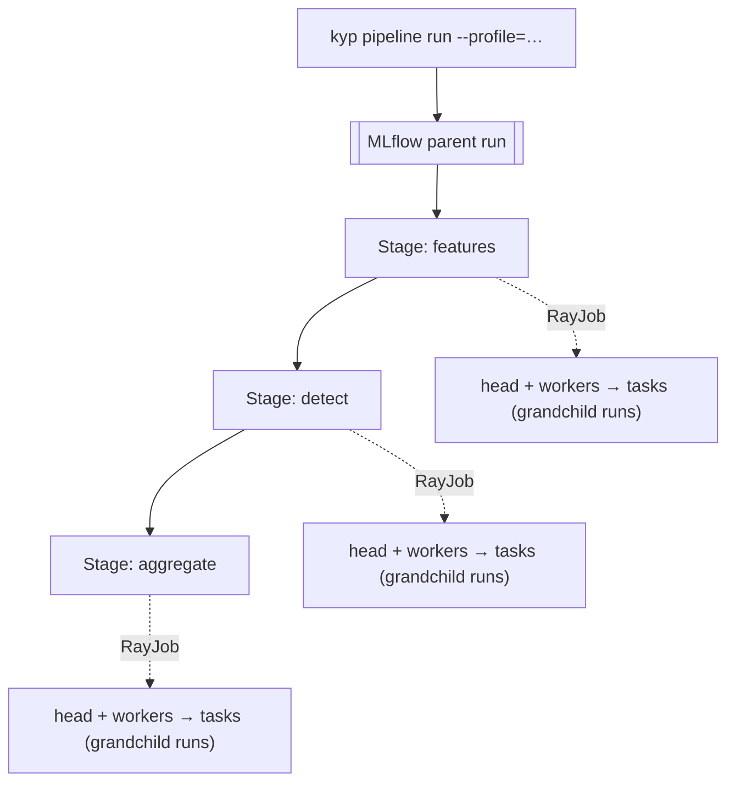

# kyper-framework PoC

Two-part foundation for data-science work at Kyper (PoC):

- **[`infra/`](infra/)** — platform deployed **once per cluster** via Helm. Provides MLflow, KubeRay operator, CloudNativePG-managed Postgres, namespaces, RBAC, and shared storage. Runs on minikube today, GCP tomorrow, same chart.
- **[`flow/`](flow/)** — the `kyp` Python framework + cookiecutter template used **per DS project**. Encodes the stage-per-RayJob execution pattern, local↔Ray parity, and MLflow wiring so DS writes only pure task functions.

## High-level architecture

```mermaid
flowchart LR
    subgraph KF["kyper-framework"]
        direction LR
        subgraph INFRA["infra/ — deployed once per env (Helm)"]
            direction TB
            I1["CNPG operator + Postgres Cluster"]
            I2["MLflow tracking server"]
            I3["KubeRay operator"]
            I4["Namespaces: ds-platform / ds-workloads"]
            I5["Shared PVC (minikube) / GCS (GCP)"]
            I6["RBAC + ResourceQuota"]
            I7["values-{minikube,gcp-dev,gcp-prod}.yaml"]
        end
        subgraph FLOW["flow/ — cloned per DS project (Cookiecutter + kyp)"]
            direction TB
            F1["@task / @stage / @pipeline"]
            F2["LocalExecutor / RayExecutor"]
            F3["MLflow parent/child wiring"]
            F4["RayJob renderer + submitter"]
            F5["kyp CLI"]
            F6["Template: src/ · pipelines/ · configs/platforms/"]
        end
    end
    OPS(["ops / platform team"]) -- "helm install" --> INFRA
    DS(["data scientist"]) -- "cookiecutter new" --> FLOW
    FLOW -- "submits RayJobs / logs runs" --> INFRA
```

A pipeline run fans out as **stage → RayJob → task**, with MLflow emitting a parent/child/grandchild run tree. Profiles (`local | minikube | gcp-*`) switch substrate without touching task code. Full detail in [`docs/00-architecture.md`](docs/00-architecture.md).

## Design docs

| Doc | Purpose |
|---|---|
| [`docs/00-architecture.md`](docs/00-architecture.md) | High-level architecture and the two-part split |
| [`docs/01-implementation-plan.md`](docs/01-implementation-plan.md) | Phased build order, milestones, acceptance gates |
| [`docs/02-infra-platform.md`](docs/02-infra-platform.md) | Helm chart structure, CNPG, MLflow, KubeRay, env overlays |
| [`docs/03-flow-framework.md`](docs/03-flow-framework.md) | `kyp` package, cookiecutter template, CLI surface |
| [`docs/04-pipeline-execution.md`](docs/04-pipeline-execution.md) | Stage-per-RayJob pattern, MLflow run tree, local vs cluster |
| [`docs/05-environments.md`](docs/05-environments.md) | Minikube → GCP portability matrix and the config-only delta |

## Principles

1. **Pure Python tasks.** DS writes `@task def fn(spec) -> result`. No Ray/MLflow imports in project code.
2. **Stage = RayJob.** Each pipeline stage runs as its own ephemeral Ray Job; no long-lived driver loops across stages.
3. **One codebase, many targets.** `--profile=local|minikube|gcp-dev|gcp-prod` switches execution substrate, not logic.
4. **Platform is Helm. Project is Cookiecutter.** Two orthogonal delivery mechanisms, versioned separately.
5. **MLflow is implicit.** Parent/child/grandchild run tree is emitted by the framework; DS never calls `mlflow.*`.
