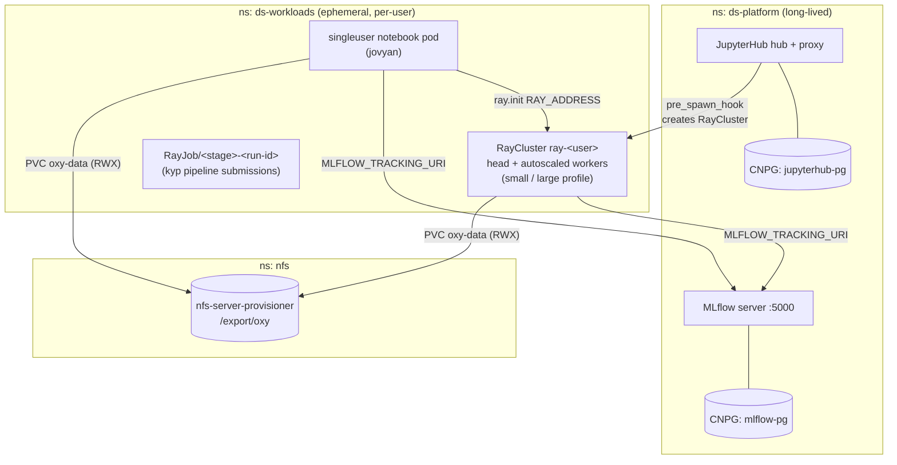
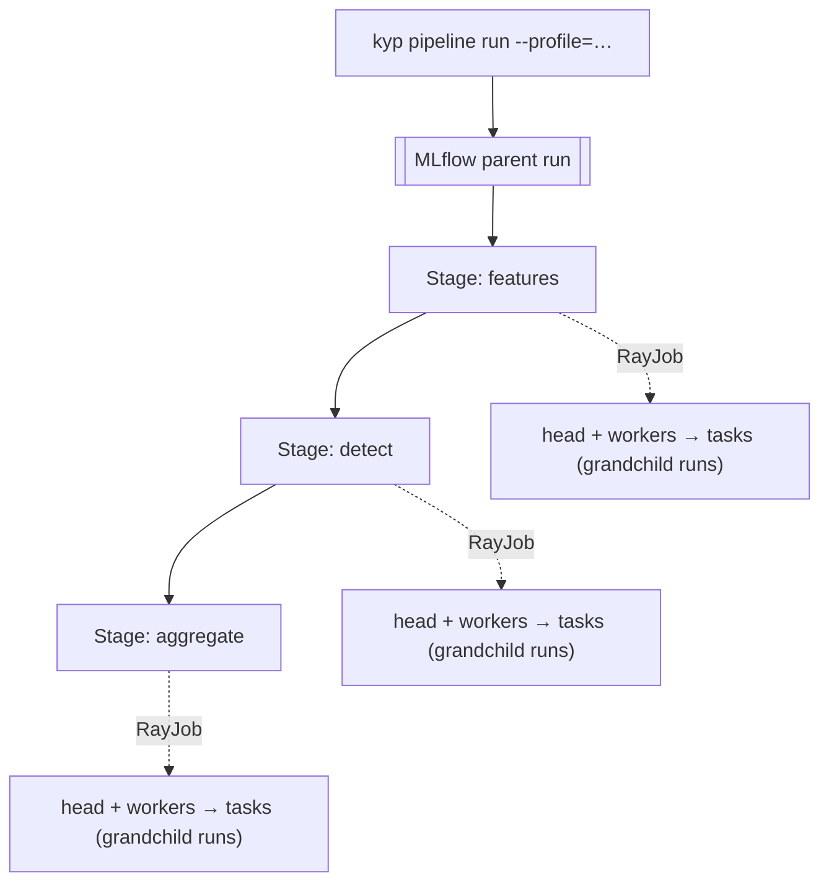

# kyper-framework PoC

Two-part foundation for data-science work at Kyper (PoC):

- **[`infra/`](infra/)** — platform deployed **once per cluster** via Helm. Provides JupyterHub (with on-demand per-user Ray clusters), MLflow, KubeRay operator, CloudNativePG-managed Postgres, NFS-backed shared data, namespaces, and RBAC. Runs on minikube today, GCP tomorrow, same chart.
- **[`flow/`](flow/)** — the `kyp` Python framework + cookiecutter template used **per DS project**. Encodes the stage-per-RayJob execution pattern, local↔Ray parity, and MLflow wiring so DS writes only pure task functions.
- **[`notebooks/`](notebooks/)** — reference PoC: [`anomaly_detection_ray_parallel.ipynb`](notebooks/anomaly_detection_ray_parallel.ipynb) runs 6 PyOD models across sensor data with Ray-parallel fan-out and MLflow nested runs.

## High-level architecture

```mermaid
flowchart LR
    subgraph KF["kyper-framework"]
        direction LR
        subgraph INFRA["infra/ — Helm umbrella chart (kyper-ds-platform)"]
            direction TB
            I1["CNPG operator + 2× Postgres Clusters<br/>(MLflow backend, JupyterHub backend)"]
            I2["MLflow tracking server<br/>(PVC-backed artifacts on minikube)"]
            I3["KubeRay operator (cluster-wide)"]
            I4["JupyterHub<br/>(per-user notebook + on-demand RayCluster)"]
            I5["NFS-backed shared data PVC (oxy-data, RWX)"]
            I6["Namespaces: ds-platform / ds-workloads<br/>+ RBAC"]
            I7["values-minikube.yaml · values-nfs.yaml · values-gcp-*.yaml"]
        end
        subgraph FLOW["flow/ — per-project (Cookiecutter + kyp)"]
            direction TB
            F1["@task / @stage / @pipeline"]
            F2["LocalExecutor / RayExecutor"]
            F3["MLflow parent/child wiring"]
            F4["RayJob renderer + submitter"]
            F5["kyp CLI"]
            F6["Template: src/ · pipelines/ · configs/platforms/"]
        end
    end
    OPS(["ops / platform team"]) -- "helm install" --> INFRA
    DS(["data scientist"]) -- "cookiecutter new<br/>or JupyterHub login" --> FLOW
    FLOW -- "submits RayJobs / logs runs" --> INFRA
```

## Cluster runtime

## Pipeline run (kyp CLI path)

Full detail in [`docs/00-architecture.md`](docs/00-architecture.md).

## Chart components (pinned)

| Component | Version | Source |
|---|---|---|
| `cloudnative-pg` | 0.28.0 | https://cloudnative-pg.github.io/charts |
| `kuberay-operator` | 1.6.0 | https://ray-project.github.io/kuberay-helm/ |
| `jupyterhub` | 4.3.3 | https://hub.jupyter.org/helm-chart/ |
| MLflow image | `ghcr.io/mlflow/mlflow:v3.11.1-full` | — |
| Ray image | `rayproject/ray:2.41.0-py312` | — |

## Design docs

| Doc | Purpose |
|---|---|
| [`docs/00-architecture.md`](docs/00-architecture.md) | High-level architecture and the two-part split |
| [`docs/01-implementation-plan.md`](docs/01-implementation-plan.md) | Phased build order, milestones, acceptance gates |
| [`docs/02-infra-platform.md`](docs/02-infra-platform.md) | Helm chart structure, CNPG, MLflow, KubeRay, env overlays |
| [`docs/03-flow-framework.md`](docs/03-flow-framework.md) | `kyp` package, cookiecutter template, CLI surface |
| [`docs/04-pipeline-execution.md`](docs/04-pipeline-execution.md) | Stage-per-RayJob pattern, MLflow run tree, local vs cluster |
| [`docs/05-environments.md`](docs/05-environments.md) | Minikube → GCP portability matrix and the config-only delta |

Per-component docs: [`infra/README.md`](infra/README.md), [`flow/README.md`](flow/README.md), [`k8s/minikube/README.md`](k8s/minikube/README.md).

## Principles (what the PoC demonstrates)

1. **One Helm chart, one env delta.** Cluster is stood up from `kyper-ds-platform` + a single `values-<env>.yaml`; no per-env template edits.
2. **JupyterHub is the DS entry point.** Login spawns a singleuser pod in `ds-workloads` and a matching `RayCluster` (small/large profile) via `pre_spawn_hook`; `post_stop_hook` tears it down.
3. **Per-user Ray, not shared Ray.** Each user gets their own autoscaling `RayCluster` pinned to `kyper.ai/role=workload` nodes — isolation by default, no noisy-neighbour contention.
4. **Ray-parallel fan-out, MLflow nested runs.** Notebook pattern: parent run → `@ray.remote` tasks per (sensor × model) → each task logs as a child run. `MLFLOW_TRACKING_URI` is injected into singleuser *and* Ray pods.
5. **Shared data via RWX PVC.** `oxy-data` (NFS-backed) is mounted at `/mnt/oxy` in both the notebook pod and every Ray pod — same path, same bytes, no copying.
6. **Pinned versions.** Ray 2.41.0, MLflow v3.11.1, KubeRay 1.6.0, CNPG 0.28.0, JupyterHub 4.3.3 — upgrades are deliberate.

Target design for the `flow/` framework (pure-Python `@task`, stage-per-RayJob, `kyp` CLI, profile-switched substrate) lives in [`docs/03-flow-framework.md`](docs/03-flow-framework.md) and [`docs/04-pipeline-execution.md`](docs/04-pipeline-execution.md) — not yet implemented.
